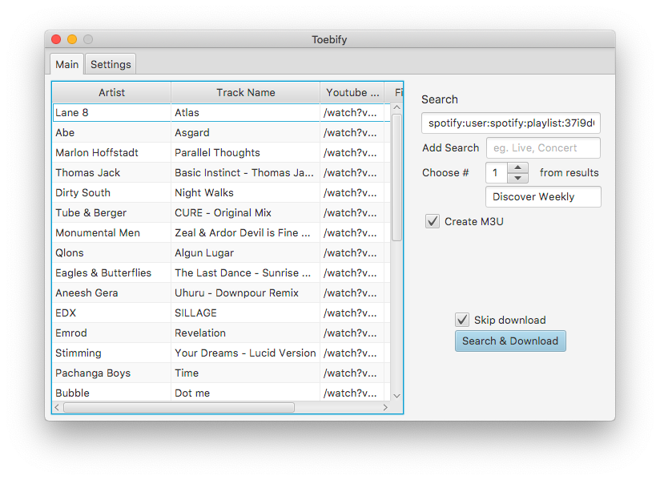

# Toebify

### Download
You will find pre-build binaries at the [Release page](https://github.com/cybertim/toebify/releases).
### About
Process a playlist into mp3's downloaded from youtube videos - because sometimes you need the audio offline (like android wear...)
### Setup
1.  If you have Maven installed:
`mvn clean compile exec:java`
2. Go to the Settings Tab and complete all settings (eg. create spotify application and install ffmpeg/youtube-dl)
3. Open Spotify and click on the 'Share' button of a playlist.
Copy/paste the URI into the URI field of the Main tab.
4. Try without download check the 'skip download' and see if the playlist loads into the table.
5. ...